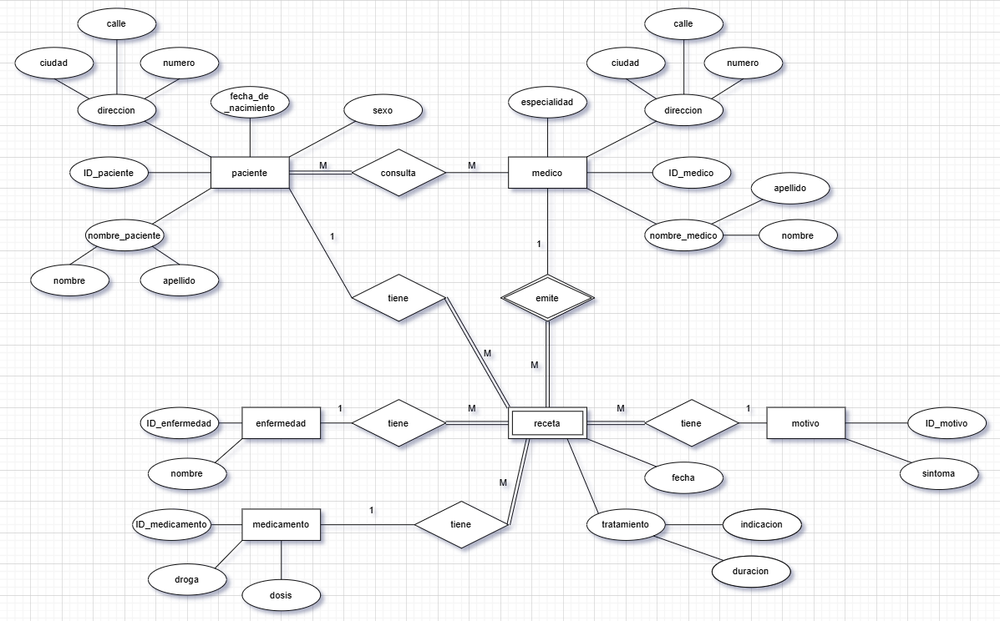

# Parte 1: Bases de Datos

## 1. Tipo de base de datos
La base de datos e una de tipo SQL. Los datos están organizados en formato de tablas, columnas y relaciones, por lo que es estructurada y así pueden ser leídos y entendidos de forma eficaz por software o por persona. Con respecto a la función se trata de una base de datos transaccional por lo que los registros se dan en transacciones. Las propiedades de las transacciones son la atomicidad, consistencia, aislamiento y durabilidad. 

## 2. Diagrama Entidad-Relación


## 3. Modelo lógico entidad-relación


Para los ejercicios 2 y 3 la realización del Diagrama Entidad-Relación y el Modelo Lógico se optó por hacer una nueva implemantación en base a los requerimientos sin hacer una nueva base de datos. Se consideró la interpretación del enunciado, según la cual los atributos correspondientes a pacientes y a medicos son los que figuran en sus respectivas fichas. Al asistir al centro de salud, cada paciente consulta a un médico, el cual emite recetas con atributos correspondientes al tratamiento, motivo y fecha de la consulta, diagnóstico (enfermedad) y los datos del paciente que realizó la consulta. Se asumió que la emisión de una receta por parte de un médico implica la presencia de su nombre en dicha receta, y que en distintas visitas al centro de salud los pacientes pueden atenderse con distintos médicos. 

## 4. Normalización
La base de datos dada no está normalizada. Una base de datos está normalizada cuando se ha eliminado las redundancias, inconsistencias y logrado integridad de los datos. Al comparar las tablas de consultas y recetas se ve que ambas tablas tienen su identificador único las claves foráneas de id_medicos e id_pacientes pero además en ambas tablas están los valores de fecha. Por lo que se ve que los datos están repetidos, y por ende se debería depurar estas tablas. 

---

# Parte 2: SQL
## Query 01

Se hace un index para mejorar la búsqueda de los pacientes agrupados por ciudad. Además hace una función en para eliminar el índice y verificar que ha sido creado y además se hace una función para que se muestren todos los índices de la base de datos.

```
CREATE INDEX idx_ciudad ON pacientes(ciudad);

DROP INDEX idx_ciudad;

SELECT indexname, indexdef 
FROM pg_indexes
WHERE schemaname = 'public';

```


---
## Query 02

```
SELECT id_paciente, nombre, fecha_nacimiento,
       DATE_PART('year', AGE(CURRENT_DATE, fecha_nacimiento)) AS edad
FROM pacientes;

# DATE_PART('year', ...)	Extrae solamente los años completos del intervalo.
# AGE(CURRENT_DATE, fecha_nacimiento)	Calcula la diferencia entre la fecha actual y la fecha de nacimiento → da un intervalo de tiempo (como "24 years 2 mons 3 days").

```


---
## Query 03

```
UPDATE pacientes
SET calle = 'Calle Corrientes',
    numero = '500',
    ciudad = 'Buenos Aires'
WHERE nombre = 'Luciana Gómez'
  AND calle = 'Avenida Las Heras'
  AND numero = '121';
```


---
### Query 04

```
SELECT nombre, matricula
FROM medicos
WHERE especialidad_id = 4;
```


---
## Query 05

En esta operación se modifica la base de datos. Se usan dos veces la función update una primera para modificar los registros en la columna ciudad de la tabla de pacientes. Luego se usa la función update nuevamente para comparar estos mismos datos para comparar con una tabla de referencia creada con el nombre correcto de las ciudades. Esta última función verifica la coincidencia para asignar los nombres correctos para corregir la inconsistencia en estos datos. 

```
UPDATE pacientes
SET ciudad = INITCAP(REGEXP_REPLACE(TRIM(ciudad), '\s+', ' ', 'g'));

CREATE TABLE ciudades_referencia (
    id_ciudad_referencia SERIAL PRIMARY KEY,
    nombre VARCHAR(50)
);

INSERT INTO ciudades_referencia (id_ciudad_referencia, nombre) VALUES
(DEFAULT, 'Buenos Aires'),
(DEFAULT, 'Córdoba'),
(DEFAULT, 'Rosario'),
(DEFAULT, 'Mendoza'),
(DEFAULT, 'Santa Fé');

CREATE EXTENSION IF NOT EXISTS pg_trgm;

SELECT DISTINCT
  p.ciudad AS ciudad_original,
  cr.nombre AS ciudad_normalizada,
  similarity(p.ciudad, cr.nombre) AS similitud
FROM pacientes p
JOIN ciudades_referencia cr
  ON similarity(p.ciudad, cr.nombre) >= 0.2
ORDER BY ciudad_original, similitud DESC;

UPDATE pacientes p
SET ciudad = (
    SELECT cr.nombre
    FROM ciudades_referencia cr
    WHERE similarity(p.ciudad, cr.nombre) >= 0.2
    ORDER BY similarity(p.ciudad, cr.nombre) DESC
    LIMIT 1
)
WHERE EXISTS (
    SELECT 1
    FROM ciudades_referencia cr
    WHERE similarity(p.ciudad, cr.nombre) >= 0.2
);
```


---
## Query 06

```
SELECT nombre, calle, numero, ciudad
FROM pacientes
WHERE ciudad = 'Buenos Aires';
```


---
## Query 07

```
SELECT p.ciudad AS ciudad, COUNT(*) AS cantidad
FROM pacientes p
GROUP BY ciudad
ORDER BY cantidad DESC;

# AS ciudad: se usa un alias para que en el resultado, esa columna se muestre con el nombre ciudad.
# COUNT(*) AS cantidad: se cuenta cuantas filas (es decir, cuántos pacientes) hay para cada ciudad, y el resultado se mostrará con el nombre cantidad.

# GROUP BY ciudad: se agrupa los datos por ciudad
# ORDER BY cantidad DESC: se ordena el resultado y con DESC hace de mayor a menor.
```


---
## Query 08

```
SELECT p.ciudad AS ciudad, s.descripcion AS sexo, COUNT(*) AS cantidad
FROM pacientes p
JOIN sexobiologico s ON p.id_sexo = s.id_sexo
GROUP BY p.ciudad, s.descripcion
ORDER BY ciudad, sexo;
```


---
## Query 09

```
SELECT m.nombre, COUNT(r.id_receta) AS cantidad_recetas
FROM medicos m
LEFT JOIN recetas r ON m.id_medico = r.id_medico
GROUP BY m.nombre
ORDER BY cantidad_recetas DESC;

# LEFT JOIN Recetas r ON m.id_medico = r.id_medico	une la tabla recetas con medicos, pero incluye todos los médicos, incluso si no tienen recetas.
# COUNT(r.id_receta) Cuenta cuántas recetas tiene cada médico (si no tiene, cuenta 0 gracias al LEFT JOIN).
```


---
## Query 10

```
SELECT *
FROM consultas
WHERE id_medico = 3 AND fecha BETWEEN '2024-08-01' AND '2024-08-31';
```


---
## Query 11

```
SELECT p.nombre AS nombre_paciente, c.fecha, c.diagnostico
FROM consultas c
JOIN pacientes p ON c.id_paciente = p.id_paciente
WHERE c.fecha BETWEEN '2024-08-01' AND '2024-08-31'
ORDER BY c.fecha;

#JOIN Pacientes p ON c.id_paciente = p.id_paciente	Relaciona cada consulta con su paciente
```


---
## Query 12

```
SELECT m.nombre AS nombre_medicamento, COUNT(*) AS veces_prescrito
FROM recetas r
JOIN medicamentos m ON r.id_medicamento = m.id_medicamento
WHERE r.id_medico = 2
GROUP BY m.nombre
HAVING COUNT(*) > 1
ORDER BY veces_prescrito DESC;
```


---
## Query 13

```
SELECT p.id_paciente AS id_pacintes, p.nombre AS nombres, COUNT(r.id_receta) AS cantidad_recetas
FROM pacientes p
LEFT JOIN recetas r ON p.id_paciente = r.id_paciente
GROUP BY p.id_paciente
ORDER BY cantidad_recetas DESC;
```


---
## Query 14

```
WITH cantidad_recetas AS (
  SELECT m.nombre AS nombre_medicamento, COUNT(r.id_receta) AS total
  FROM recetas r 
  JOIN medicamentos m ON r.id_medicamento = m.id_medicamento
  GROUP BY m.nombre
)
SELECT nombre_medicamento, total AS cantidad_recetas
FROM cantidad_recetas
WHERE total = (SELECT MAX(total) FROM cantidad_recetas);
```


---
## Query 15

```
SELECT p.nombre AS nombre_paciente, c.fecha, c.diagnostico
FROM pacientes p
JOIN consultas c ON p.id_paciente = c.id_paciente
WHERE c.fecha = ( SELECT MAX(c.fecha) FROM consultas c WHERE c.id_paciente = p.id_paciente)
ORDER BY p.nombre;
```


---
## Query 16

```
SELECT m.nombre AS nombre_medico, p.nombre AS nombre_paciente, COUNT(*) AS total_consultas
FROM consultas c
JOIN medicos m ON c.id_medico = m.id_medico
JOIN pacientes p ON c.id_paciente = p.id_paciente
GROUP BY m.nombre, p.nombre
ORDER BY m.nombre, p.nombre;
```


---
## Query 17

```
SELECT med.nombre AS medicamento, COUNT(*) AS total_recetas, 
       m.nombre AS medico, p.nombre AS paciente
FROM Recetas r
JOIN Medicamentos med ON r.id_medicamento = med.id_medicamento
JOIN Medicos m ON r.id_medico = m.id_medico
JOIN Pacientes p ON r.id_paciente = p.id_paciente
GROUP BY med.nombre, m.nombre, p.nombre
ORDER BY total_recetas DESC;
```


---
## Query 18

```
SELECT m.nombre AS nombre_medico, COUNT(DISTINCT c.id_paciente) AS total_pacientes
FROM consultas c
JOIN medicos m ON c.id_medico = m.id_medico
GROUP BY m.nombre
ORDER BY total_pacientes DESC;
```


---
